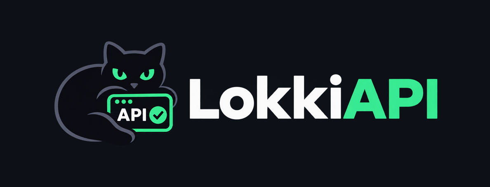

<p align="center">
  
</p>

<p align="center">
  Локальный, файловый клиент для тестирования API — лёгкая альтернатива Postman и Insomnia.
</p>

<p align="center">
  <a href="README.md">English version</a>
</p>

---

## О проекте

LokkiAPI решает три вещи, которые в существующих клиентах сделаны иначе.

**Данные — обычные файлы, а не скрытая база.** Каждый запрос это отдельный TOML-файл в папке коллекции. Их можно читать глазами, класть в git, ревьюить в пул-реквестах, синхронизировать любым файловым способом. Никакого экспорта-импорта, чтобы поделиться коллекцией с командой.

**Приложение лёгкое.** Tauri с системным WebView вместо Electron: меньше места на диске, потребление памяти на порядок ниже, чем у клиентов на встроенном Chromium.

**Архитектура заложена на вырост.** У каждой сущности стабильный ULID и версия — будущий self-hosted сервер синхронизации подключается без миграции формата. Выполнение запросов скрыто за трейтом `ProtocolExecutor`, так что WebSocket, SSE и GraphQL добавляются рядом с HTTP, а не переписыванием ядра.

**Никаких подписок никогда и вечный OpenSource.** LokkiAPI подразумевает открытость кода и отсутствие каких-либо подписок. Никогда и ни в каком виде. Весь функционал любой человек и компания могут использовать на безвозмездной основе.

## Возможности

**Запросы**
- Методы GET, POST, PUT, PATCH, DELETE, HEAD, OPTIONS
- Параметры строки запроса и заголовки с включением и отключением строк
- Тело: JSON, произвольный текст, форма (urlencoded)
- Авторизация: без неё, Bearer-токен, Basic
- Предпросмотр итогового адреса с подставленными переменными и кнопкой копирования
- Отправка по Ctrl+Enter, сохранение по Ctrl+S

**Коллекции**
- Вложенные папки любой глубины
- Перетаскивание для сортировки и переноса между папками и коллекциями
- Переименование и удаление через меню ⋯, там же «Развернуть все» и «Свернуть все» для коллекции
- Порядок папок и запросов задаётся вручную и хранится в файлах

**Окружения и переменные**
- Глобальные окружения и окружения коллекции, коллекция перекрывает глобальное
- Подстановка `{{переменной}}` в адресе, параметрах, заголовках, теле и авторизации
- Автодополнение переменных по `{{` с показом значения и области видимости
- Предупреждение в ответе, если переменная не нашлась
- Секретные переменные хранятся вне синхронизируемого дерева

**Ответ**
- Статус, длительность, размер тела и время выполнения
- Вкладки «Тело» и «Заголовки», заголовки в виде таблицы
- Подсветка синтаксиса JSON в палитре GitHub, форматирование ответа
- Последний ответ запоминается для каждого запроса отдельно

**Интерфейс**
- Русский и английский язык интерфейса: при первом запуске берётся из языка ОС, откат на английский; переключается в «Настройки → Интерфейс»
- Светлая и тёмная тема: по умолчанию следует за системой, можно закрепить любую в «Настройки → Интерфейс»
- Запрос и ответ друг под другом или рядом - выбирается в «Настройки → Интерфейс»
- Растягиваемые панели: ширина дерева коллекций и граница между запросом и ответом
- Дерево запоминает, какие коллекции и папки были раскрыты
- Последний открытый workspace восстанавливается при запуске

## Установка

Сборки под все три платформы приложены к каждому релизу — берите из [последнего](https://github.com/Lisovsky-UwU/lokki-api/releases/latest). Доустанавливать ничего не нужно: интерфейс рисуется через WebView, который уже есть в системе, а данные лежат в папке-воркспейсе, которую вы выбираете сами.

**Windows x64**
- `…_x64-setup.exe` — обычный установщик
- `…_x64_en-US.msi` — для развёртывания через групповые политики

**Linux x86_64**
- `.deb` — Debian, Ubuntu, Mint: `sudo apt install ./<скачанный файл>`
- `.rpm` — Fedora, openSUSE: `sudo dnf install ./<скачанный файл>`
- `.AppImage` — любой дистрибутив, включая Arch: сделать исполняемым и запустить

**macOS**
- `.dmg` с `aarch64` — Apple Silicon
- `.dmg` с `x64` — Intel

Сборки пока не подписаны. Windows SmartScreen прячет кнопку «Всё равно выполнить» под «Подробнее», а macOS считает приложение повреждённым, пока не снят карантинный флаг: `xattr -cr /Applications/LokkiAPI.app`.

Собрать самому — две команды, см. [Разработку](#разработка).

## Как устроен workspace на диске

Workspace — это обычная папка, которую вы выбираете при первом запуске.

```
my-workspace/
  .lokki/
    workspace.toml          # идентификатор воркспейса и версия схемы
    secrets.local.toml      # значения секретных переменных (в .gitignore)
    .gitignore              # создаётся автоматически
  environments/
    Global.env.toml         # глобальные окружения
  Petstore/                 # коллекция
    collection.toml
    environments/
      Dev.env.toml          # окружения коллекции
    Pets/                   # папка
      folder.toml           # имя и позиция папки
      List Pets.lokki.toml  # запрос
```

Пример файла запроса:

```toml
[meta]
id = "01J8XA1B2C3D4E5F6G7H8J9K0M"
name = "List Pets"
seq = 1
protocol = "http"
created_at = "2026-08-01T10:05:00Z"
updated_at = "2026-09-05T09:12:44Z"
version = 5

[http]
method = "GET"
url = "{{baseUrl}}/pets"

[[http.headers]]
key = "Accept"
value = "application/json"
enabled = true

[http.auth]
type = "bearer"
token = "{{authToken}}"

[http.body]
type = "none"
```

Формат выбран как TOML, а не YAML или JSON: он не страдает от неявного приведения типов и проблем с отступами при ручной правке, даёт построчные диффы на массивах таблиц и умеет многострочные литералы для тела запроса.

### Секреты

У переменной есть флаг `secret`. Значение такой переменной **никогда** не пишется в файл окружения — в нём остаётся пустая строка, а само значение хранится в `.lokki/secrets.local.toml`, который автоматически добавляется в `.gitignore`. Поэтому папку workspace можно коммитить целиком, не опасаясь утечки токенов.

Имена переменных ограничены набором `A-Z a-z 0-9 _ . -`. Символы вне набора не подставляются при отправке, поэтому поле ввода их не принимает.

## Разработка

Требуется Rust stable, Node.js LTS и системные зависимости Tauri (на Windows — WebView2, он есть в Windows 11 из коробки).

```bash
npm install
npm run tauri dev        # запуск в режиме разработки
npm run check            # проверка типов фронтенда
npm run tauri build      # сборка инсталляторов
cd src-tauri && cargo test   # тесты ядра
```

Вспомогательные примеры для проверки ядра без интерфейса:

```bash
cd src-tauri
cargo run --example smoke              # сквозной прогон с реальным HTTP-запросом
cargo run --example fixture -- <путь>   # сгенерировать демонстрационный workspace
```

Иконки приложения перегенерируются из исходного изображения одной командой:

```bash
npx tauri icon lokki_api_logo.png
```

Перед тем как открывать pull request, прочитайте [CONTRIBUTING.md](CONTRIBUTING.md) — там про ветки, сообщения коммитов, обязательные проверки и то, как выпускается релиз (файл на английском).

## Архитектура

| Слой | Технология |
|---|---|
| Оболочка | Tauri 2, системный WebView |
| Ядро | Rust: домен, файловое хранилище, выполнение запросов, интерполяция |
| Интерфейс | Svelte 5 + TypeScript, CodeMirror 6 |
| Транспорт | reqwest с rustls, без зависимости от OpenSSL |

Модули ядра (`src-tauri/src`):

| Модуль | Назначение |
|---|---|
| `domain/` | Модели: workspace, коллекция, папка, запрос, окружение, `SyncMeta` с идентификатором и версией |
| `store/` | Чтение и запись TOML, обход дерева коллекций, перемещение и сортировка, локальное состояние интерфейса |
| `exec/` | Трейт `ProtocolExecutor` и реализация HTTP, сборка запроса с подстановкой переменных |
| `interpolate/` | Резолвер `{{переменных}}`: окружение коллекции перекрывает глобальное |
| `secrets/` | Трейт `SecretStore` и локальная файловая реализация |
| `i18n/` | Все сообщения, которые ядро показывает пользователю, на английском и русском |
| `commands/` | Слой команд Tauri — единственный путь изменений со стороны интерфейса |

Ключевое архитектурное правило: **интерфейс никогда не пишет файлы напрямую**, все изменения проходят через `store`. Это и есть точка, куда подключится будущий движок синхронизации, не затрагивая ни домен, ни компоненты.

Фронтенд разделён на `stores` (реактивное состояние), `api/client.ts` (типизированная обёртка над командами), `components`, `ui` (диалоги, ошибки, общие утилиты) и `i18n` (каталоги строк). Типы в `bindings/types.ts` повторяют доменные структуры Rust с точностью до имён полей, поскольку те же структуры сериализуются и в файлы, и в IPC.

## Роадмап

Ведется только в [английской версии README](README.md).

## Лицензия

[Apache License 2.0](LICENSE).

Проект можно свободно использовать, изменять и включать в закрытые продукты,
в том числе коммерческие. Лицензия включает явную патентную лицензию от
участников и защиту от патентных исков. Название «LokkiAPI» и логотип под
лицензию не подпадают — см. `NOTICE` и раздел 6 лицензии.
